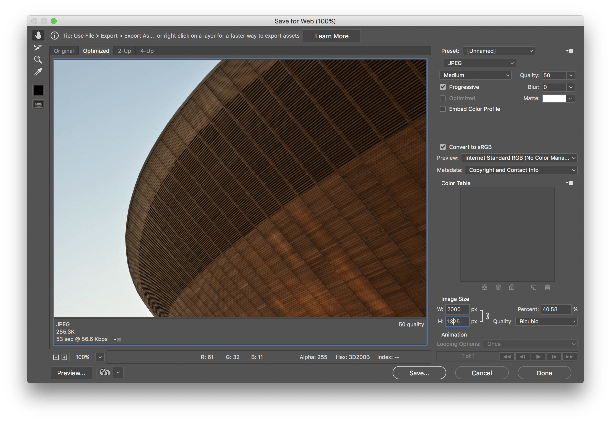
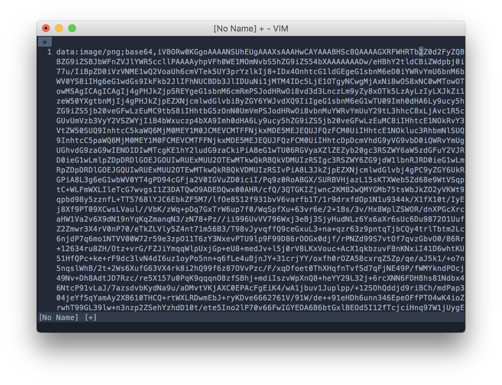
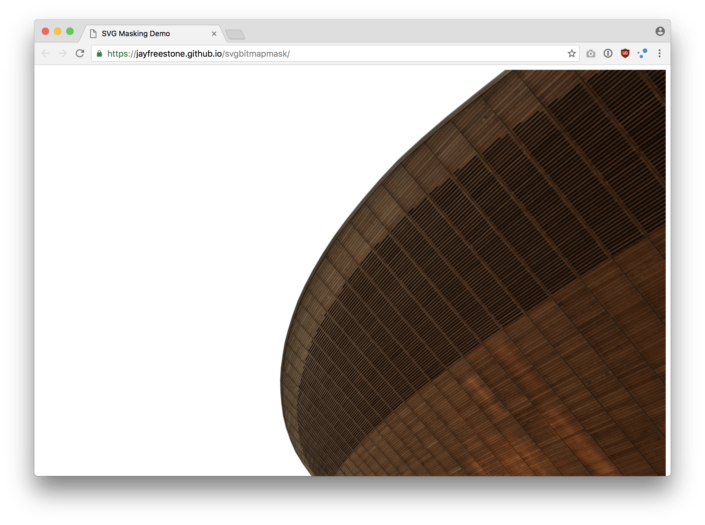

I was recently reminded about Peter Hrynkow’s excellent article *[Using SVG to Shrink your PNGs](http://peterhrynkow.com/how-to-compress-a-png-like-a-jpeg/)* when looking for ways to reduce the size of several large images on a project.

There are a variety of great PNG compression tools, such as `pngquant` and `pngnq`, but when it comes to compressing a photograph it’s hard to beat a JPG — at least if widespread browser support matters. Peter’s trick involves leveraging SVG’s support for masking to provide JPEGs with a means to transparency, and therefore the best of both worlds.

It’s a neat trick, but comes with one significant caveat: there’s no easy way to use responsive images with it. Since the `image` tag within an SVG lacks a `srcset` equivalent, you're stuck with one asset size. Not wanting to sacrifice either, I started to play around with how best to combine the two.

A media query (with `display: none` etc.) works, but it doesn't stop multiple assets from being downloaded. An alternative would be to plop Peter’s SVG markup into an external file and use the SVG within an `img` tag. Then we could make use of the browser’s native support for `srcset`, while benefiting from our newfound masking technique. However, browsers apparently (for security reasons) refuse to fetch external assets (e.g. `xlink:href="img/can-top-alpha.png"`) within files referenced by an `img`. The image fails to render and we’re left with a blank canvas, and back to square one.

We can get around this by base64 encoding the image, so the entire image is already ‘in’ the SVG, which works great. However, since base64 encoded files are 15-20% larger than their bitmap counterparts, we’re well on our way to defeating the entire point of the enterprise.

The best solution I could think of was to use a normal `img` tag (with the bitmap image) and then use JavaScript to grab the source and add it to the SVG `image`. This way I can leverage `srcset` without having to write asset-choosing logic, and then just simply swap out the source on resize. The process looks like:

1. Loop over the (hidden) images.
2. Create an SVG for each image and add to the DOM, with the `image` element and appropriate `mask`.
3. Setup a resize listener to update the `src` based on the image's `currentSrc`.

On resize the browser changes source, and the JavaScript updates the SVG as appropriate. 

Depending on how flexible (and bulletproof) you need this to be, you probably don’t even need an additional `img` element for the mask, since it will always need to be exactly the same size as the main image anyway. As long as the filenames are consistent (`--large` etc), we can figure out the path ourselves.

**[You can see the result in action here](https://jayfreestone.github.io/svgbitmapmask/)** and [view the source here](https://github.com/jayfreestone/svgbitmapmask/blob/master/scripts.js). The JavaScript is written in ES6 and, for simplicity, not transpiled, so you’ll need an ES6-friendly browser to view it (not Gecko at time of writing).

## Caveats

- It’s less than ideal to duplicate elements, but each image is still only fetched once (even if it’s referenced twice) since it’s cached by the browser.
- Unless you refactor it to use two `img` tags, the naming of the masks must follow a specific pattern.
- There may be a performance penalty for re-creating a whole set of large images on load.
- Lazyloading libraries won’t work, at least out of the box.

Lazyloading is the biggest issue here. The libraries won’t fire since the `img` is set to `display: none`. You'd have to hide the image through a different method (e.g. `height: 0; overflow: hidden`), then after ‘reveal’ you'd need to trigger the JS to update the source. Although this is doable, you’d effectively be doubling the images in the DOM, which *may* be a performance problem. YMMV.
